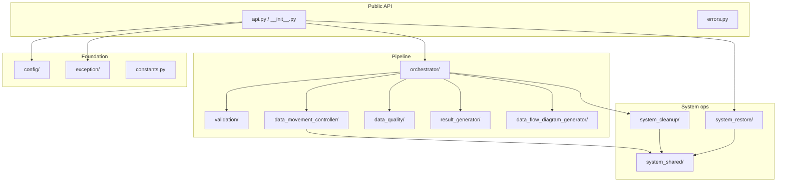

# Module reference

Complete documentation for every Python module under `src/handuflow/`. Paths below are relative to `src/handuflow/`.

## Visibility tiers

| Tier | Meaning | Import from |
|------|---------|-------------|
| **Public** | Stable API; semver applies | `import handuflow` or `handuflow.errors` |
| **Semi-public** | Subpackage `__all__`; may change with notice | `handuflow.config`, `handuflow.orchestrator`, etc. |
| **Internal** | Pipeline implementation; no stability guarantee | Full module path only |

## Architecture

## Package index

| Package | Files | Doc |
|---------|------:|-----|
| Package root | 4 | [modules/ROOT.md](modules/ROOT.md) |
| `config/` | 9 | [modules/CONFIG.md](modules/CONFIG.md) |
| `exception/` | 12 | [modules/EXCEPTION.md](modules/EXCEPTION.md) |
| `orchestrator/` | 4 | [modules/ORCHESTRATOR.md](modules/ORCHESTRATOR.md) |
| `data_movement_controller/` | 16 | [modules/DATA_MOVEMENT.md](modules/DATA_MOVEMENT.md) |
| `validation/` | 15 | [modules/VALIDATION.md](modules/VALIDATION.md) |
| `data_quality/` | 5 | [modules/DATA_QUALITY.md](modules/DATA_QUALITY.md) |
| `result_generator/` | 1 | [modules/RESULT_GENERATOR.md](modules/RESULT_GENERATOR.md) |
| `data_flow_diagram_generator/` | 1 | [modules/DATA_FLOW_DIAGRAM.md](modules/DATA_FLOW_DIAGRAM.md) |
| `system_cleanup/` | 2 | [modules/SYSTEM_CLEANUP.md](modules/SYSTEM_CLEANUP.md) |
| `system_restore/` | 2 | [modules/SYSTEM_RESTORE.md](modules/SYSTEM_RESTORE.md) |
| `system_shared/` | 3 | [modules/SYSTEM_SHARED.md](modules/SYSTEM_SHARED.md) |

**Total: 74 modules**

## Pipeline execution order

When `Orchestrator.run()` (or `handuflow.run()`) executes:

1. **Config validation** — `config.validate.validate_handuflow_config`
2. **Logging setup** — `config.logging_config.LoggingConfig`
3. **System prerequisites** — `validation.SystemLaunchValidator`
4. **Bronze ingest** — `SOURCE_TO_BRONZE` feeds via `DataLoadController`
5. **Pre-load data quality** — `FeedDataQualityRunner` (gates ingest)
6. **Medallion loads** — parallel groups via `DataLoadController`
7. **Post-load data quality** — report-only checks
8. **Result report** — `ResultGenerator` Excel workbook
9. **Lineage diagram** — `DataFlowDiagramGenerator` PNG
10. **System cleanup** — `SystemCleanup` retention + vacuum
11. **Log archival** — `LoggingConfig.move_logs_to_final_location`

Each phase is wrapped by `orchestrator.run_guard.run_phase` so failures are recorded in `RunResult.phase_errors` without aborting later cleanup.

## Related documentation

| Doc | Contents |
|-----|----------|
| [API.md](API.md) | Public Python API usage |
| [CONFIG.md](CONFIG.md) | `config.ini` keys |
| [ERROR_CODES.md](ERROR_CODES.md) | HF### error code registry |
| [MASTER_SPECS.md](MASTER_SPECS.md) | Excel column reference |
| [FEED_SPECS.md](FEED_SPECS.md) | Feed JSON schema |
| [DATA_QUALITY.md](DATA_QUALITY.md) | DQ check types |
| [SYSTEM_RESTORE.md](SYSTEM_RESTORE.md) | Restore point operations |
